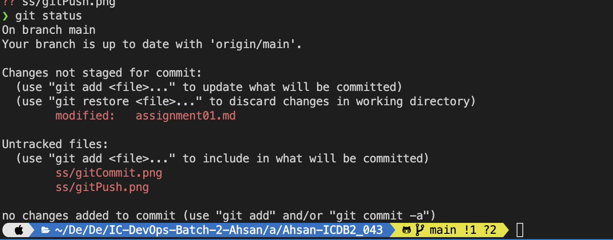
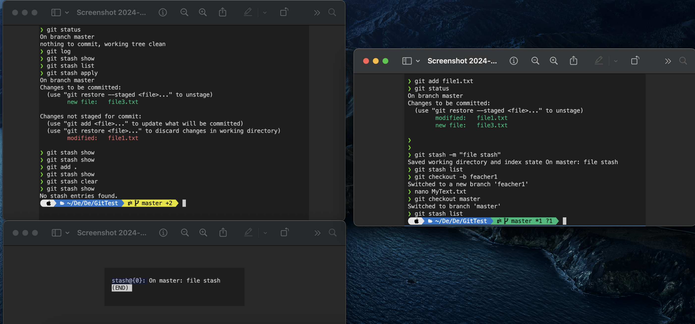

<p align="center">
    
  <h3 align="center">Version Control CheetSheet</h3>
  <p align="center">
  Some Commands in Git 
    <br>
   
  </p>
</p>


## Table of contents
- [Git Init](#git-init)
- [Git Add](#git-add)
- [Git Commit](#git-commit)
- [Git Push](#git-push)
- [Git Status](#git-status)
- [Git Rm](#git-rm)
- [Git Stash](#git-stash)
- [Git Log](#git-log)
- [Git Show](#git-show)


- [Creators](#creators)


# Git Commands

## Initialazation, Staging and Commiting

### Git Init
Initializes a new Git repository.
**Example**
``` 
git init
```


**Description :** 
Initializes a new Git repository. This command creates a new subdirectory named .git that contains all the necessary repository files.

### Git Add
Adds file contents to the staging area.
**Example**
```
git add <file1> (add one file)

git add . (all all file changes from current directory and subDirectories)
```
**Description :** 
```
This git command is used to add a specific file, or multiple files to local git repository
```


### Git Commit
The `git commit` command is used to record changes to the repository.
**Example**
```
git commit -m "commit message header" -m "Small description"
```
**Description :** 
```
Captures a snapshot of the project’s currently staged changes. Commits are snapshots that save the state of the project at that point in time.

```


### Git Push
The `git push` command is used to upload local repository content to a remote repository.
**Example**
```
git push <remote> <branch-name>
Ex: git push origin main
```
**Description :** 
```
- `git push`: This is the command to push your local commits to a remote repository.
- `origin`: This is the default name Git gives to the server from which you cloned your repository. It represents the remote repository.
- `main`: This is the name of the branch you want to push your commits to on the remote repository.
```


### Git Status
The `git status` command displays the state of the working directory and the staging area.
**Example**

```
git status
```
**Description :** 
```
It lets you see which changes have been staged, which haven't staged yet , and which files aren't being tracked by Git.
```



### Git Rm
The `git rm` command is used to remove files from the staging area and the working directory.
**Example**
```
git rm --cached<file>
Ex: git rm --cached file1.txt
```
**Description :** 

```
--cached: Removes the file only from the index (staging area) while keeping it in your working directory.

-f: Forces the removal of the file even if it has changes that are staged or it is currently being tracked.
```


### Git Stash
The `git stash` command is used to temporarily store all the modified tracked files and staged changes.
**Example**
```
git stash -m "name"
Ex: git stash -m "Work in progress"
```
**Description :** 

```
- git stash temporarily shelves (or stashes) changes you've made to your working directory so you can work on something else, and then come back and re-apply them later on.
- The stashed changes are saved onto a stack, from which they can be re-applied (or dropped) later.
Commonly used options include:
- git stash pop: Re-applies the stashed changes and removes them from the stash stack.
- git stash apply: Re-applies the stashed changes without removing them from the stash stack.
- git stash list: Lists all stashed changesets.
- git stash drop: Removes a single stashed state from the stash list.
- git stash clear: Removes all the stashed states.
```



## Inspection and Comparison

### Git Log
The `git log` command is used to display the commit logs.
**Example**
```
git log
Ex: git log --stat
```
**Description :** 
```
Displays the commit history of the current branch, listing the most recent commits at the top.Each entry in the log includes the commit ID, author, date, and the commit message.
Commonly used options include:
--oneline: Shows each commit on a single line, which is useful for a compact view of the commit history.
--graph: Displays the commit logs with an ASCII graph of the branch and merge history beside the log output.
--stat: Shows the number of files altered and the number of lines that were added or deleted.
```


### Git Show
The `git show` command is used to display various types of objects in Git, including commits, tags, and more.
**Example**
```
git show <commit hash>
```
**Description :** 
```
Displays detailed information about a specific object, typically a commit.The default option for git show when no specific flags or parameters are provided is to display the commit information for the HEAD commit.
```


## Git Diff
The `git diff` command is used to view the difference between the working directory, staging area, and the most recent commit. It shows changes line by line, highlighting additions, deletions, and modifications.
**Example**
```
   git diff
```
**Description :**
```
- `git diff` is a command for reviewing changes made to files in a repository.
- With additional arguments, such as commit hashes or file paths, git diff can compare different versions of files or commits.
```


### Git reset


## Creators

**Creator 1**

- <https://github.com/usernamecreator1>

## Thanks

